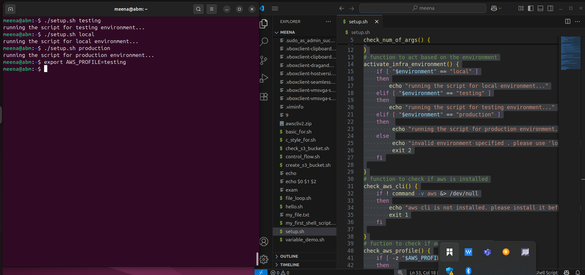

# Working_With_Function

In this mini-project, i learned how to create and structure roburst bash script that automates environment-based configurations. The script takes a single to determine the deployment environment "local, testing or production validated it through a dedicated function. I implemented modular function to improve clarity and maintanability , such as checking if the correct number of arguments is passed , verifying that the AWS CLI is installed, and confirming that the AWS PROFILE environment variable is set.

